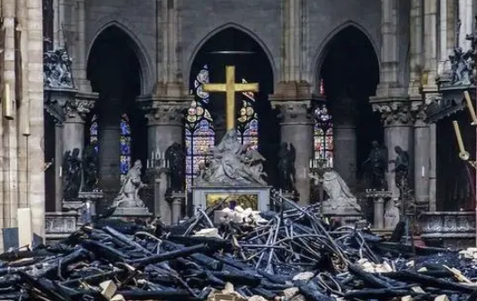

- 经过昨晚的大火，教堂已经化成了废墟。
- 
- 通过成功的侦察判定，调查员会在一个不起眼角落里发现一片倒塌的墙壁。上面用歪歪扭扭的字体写着“TERSUS”，成功的拉丁文判定让调查员意识到，在拉丁语里，这是“净化”的意思。
-
- 清晨的广场被好奇和恐惧的镇民包围，在小型喷泉前，几名警员制服住一个男性。
- 男性头部被厚厚的几层绷带包裹，狰狞的脸庞上凶狠的眼神死死地瞪着周围，他咧开嘴角，用不堪入耳的粗俗短语辱骂着调查员和警员。
	- porco dio
	- Vaffanculo
	- porcaputtana
- 放火的镇民西西弗斯
	- 失踪的镇民之一，以前是个独居的鳏夫。
	- 他要不闭嘴不言，要不反复急促地念叨着“救赎”“恶魔”“燃烧的末日”之类意义不明的宗教术语。
	- {{embed [[永恒之火]] }}
	- [[布鲁尼镇长]] 会来关注亚卓的状态。
	- 在调查员失去耐心的时候，男子勉强抬起头，朝调查员讥诮地嘲讽：
		-
		  > 愚蠢的非信者，等到北落师门星正亮的时刻，吾等将呼唤圣火的降临，唤醒燃烧的末日，净化汝等心中的恶魔，为托兰尼亚带来真正的救赎！
		- 在调查员有所反应之前，[[西斯科警长]]就掏出手枪射杀了男子。
			- 他脸色阴沉，朝调查员解释，看起来纵火的犯人就是之前失踪的镇民，而且他们已经陷入疯狂成为了邪教徒，这些狂热的邪教徒必然会严重威胁到托兰尼亚的安全。因为形势的变化，他会立刻派遣警员向区政府联络，希望调查员暂时放弃调查，在旅馆耐心等待军队的支援。
		- 如果调查员执意继续调查，西斯科警长会勉强同意为调查员提供武装，包括枪械和警棍，但依旧拒绝提供警员协助。警长也会向调查员强调，因为眼前邪教徒的疯狂表现，发现其他的邪教徒时，他要求调查员不要尝试和他们沟通，而是要直接杀死邪教徒。
-
- {{embed [[托兰尼亚的地图]] }}