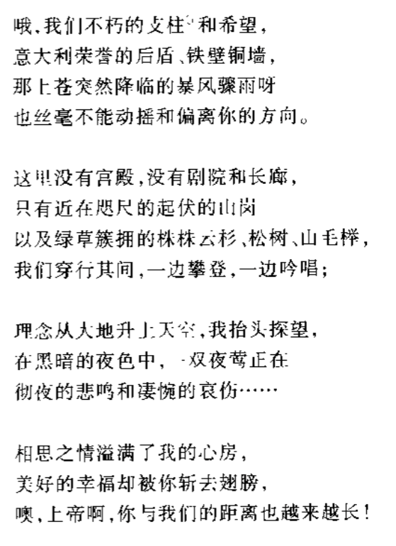

- 普通的二层小楼
- 一楼大厅：墙上挂着一些木制的动物首级（狼、鹿、熊、牛），餐桌上的篮子里放着干瘪的面包片，格纹桌布和家具上都落了一层灰。
- 二楼卧室和书房
	- 半柜子书（按类型摆好，诗集、骑士文学）
		- 一个画集，大多是写生，也有一些中世纪骑士和恶魔题材的画作
	- 一个没有纸的画架，搁着发黑的面包块和铅笔
	- 床上的被子叠的很整齐，床单平顺
	- 桌面
		- 《堂吉诃德》里夹了一页火焰的素描画
		- 插花已经彻底枯萎了，台历还在八月份
		- 一些散乱的纸张
			- 暴食狂饮，无所事事而又冷酷无情
			  取代了人生中所有美好的品质和德行，
			  被恶习恶行纠缠得疲惫不堪的天性，
			  使我们几乎全部偏离了正常的人生。
			  
			  上帝给人类的仁慈熏陶渐渐淡远，
			  生活形态变得越来越失去体统，
			  谁想让埃利科纳山的诗人之泉涓流成河
			  简直就像天大的笑话一样荒诞不经。
			  
			  荣耀算什么，诗人又有什么用？
			  噢，科学与文学贫穷而又软弱，
			  遭到了整天忙于蝇头小利者的冷嘲热讽。
			- 
			- 
			- 
			- 
			-
- 和 [[失踪居民住宅C：雅各布家]] 是邻居。