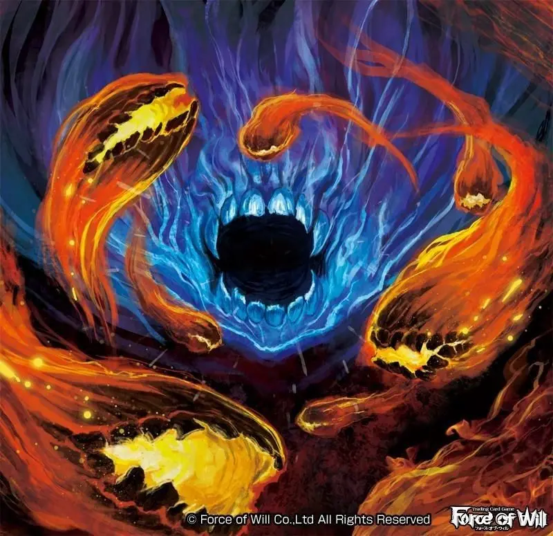

- 
- 它们看起来是成千上万的微小光点……这无数光点是有生命的火焰，聚散，追逐，整体像心脏一样脉动着，幻化成各种各样的形状。
  id:: 616e9b1f-4947-4b16-9f14-0b939a9615c3
-
- 法术：炎之精有20%的几率知晓1D3个法术。
- 炎之精，纵火者
- 属性          平均           掷骰
- STR           N/A
- CON           35            (2D6X5)
- SIZ             01             (01)
- DEX           80              ((3D6+6)X5)
- INT             50             (3D6X5)
- POW          65             (2D6+6X5)
- HP：3
- 平均伤害加成：N/A
- 平均体格：-2
- 平均魔法值：13
- 移动：11点飞行
- 攻击
- 每回合攻击：1次
- 战斗方式：炎之精通过接触攻击，被接触的可燃目标会被点燃。它们通过热休克对人类造成伤害。掷2D6作为炎之精造成的伤害以判定热休克，如果调查员通过了CON检定，只承受一半伤害；如果失败，承受完全伤害。
- 在同一次攻击中，炎之精会试图从它的目标身上偷取魔法值，此时需要进行对抗POW检定：如果炎之精胜利，则从受害者身上偷取1D10点魔法值；如果目标获胜，炎之精自己失去一点魔法值。也就是说炎之精每次攻击需要掷两次骰——一次决定热休克伤害，一次决定魔法值损失。
- 格斗 85%（42/7），造成2D6点烧灼伤害+吸取魔法值
- 躲避 40%（20/8）
- 护甲：普通材料制成的武器无法伤害它们（例如刀刃和子弹）。向一个炎之精泼水，每半加仑可以使它损失1点HP，**一个普通的手持灭火器可以造成1D6点伤害，一桶水可以造成1D3点伤害。**
- 理智丧失：直视炎之精丧失0/1D6点理智。（在六版规则书中，直视这个丢人的东西甚至不需要Sancheck）